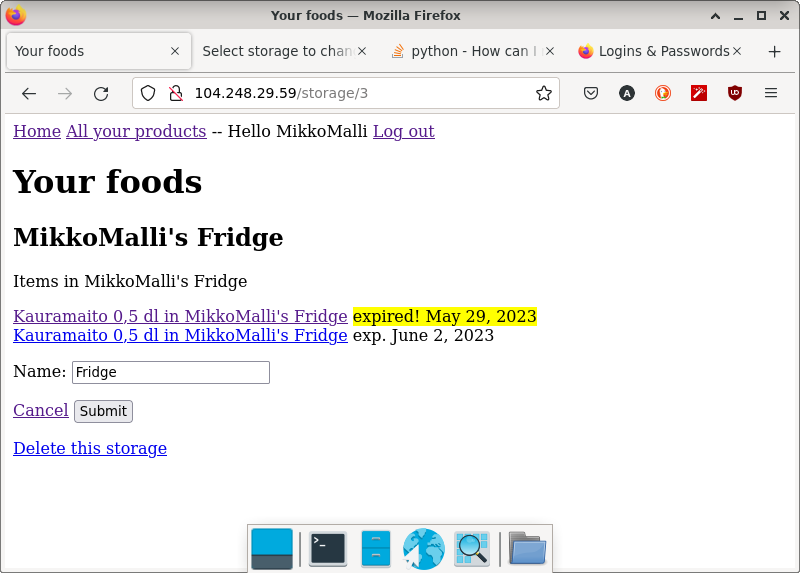

Lyhyt kouluprojektina djangolla tuotettu verkkosivu, jossa ajatuksena on tuottaa käyttäjille palvelu, johon he voivat tallentaa kotinsa kaapeissa olevatruuat, jotta käyttäjä voi esimerkiksi kaupassa tarkistaa mitä kaapeista löytyy ja mikä kaipaa päivitystä. Tuotteille voi antaa myös vanhenemispäivän, jonka ylittyssä tuote korostetaan.

Työn tekemisessä apuna ja lähteenä käytetty pääosin:

Tero Karvinen. 2023. Tero's Classy Django Cheatsheet.  https://terokarvinen.com/2023/django-cheatsheet/

Tero Karvinen. 2022. Deploy Django 4 - Production Install. https://terokarvinen.com/2022/deploy-django/
